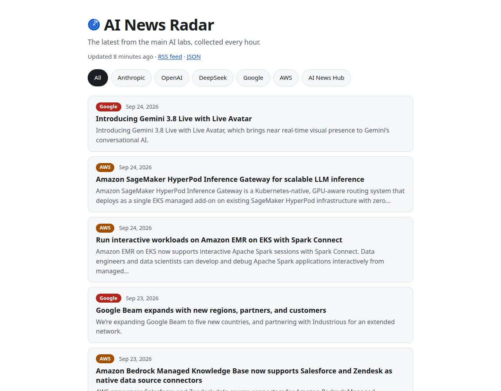
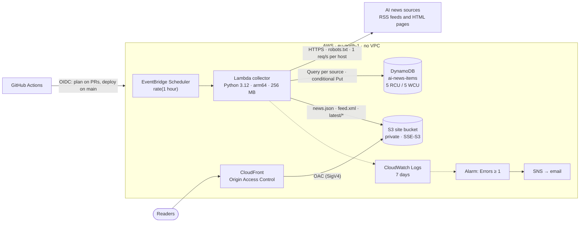

# AI News Radar

[](https://github.com/Minelli-D/ai-news-radar/actions/workflows/ci.yml)
[](https://github.com/Minelli-D/ai-news-radar/actions/workflows/deploy.yml)
[](LICENSE)

**Live:** _the CloudFront URL goes here after the first deploy_ · [RSS feed](#public-endpoints) · [JSON](#public-endpoints)

The latest news from the main AI players (Anthropic, OpenAI, DeepSeek, Google, AWS and AI
News Hub) on one fast page, refreshed every hour. It runs on a fully serverless AWS stack,
built and deployed with Terraform and GitHub Actions, for about **one cent a month**.



## Architecture



## How it works

1. Every hour **EventBridge Scheduler** invokes the **collector** Lambda.
2. The collector fetches the six sources **in parallel**:
   - one polite HTTPS request per feed or page, with a descriptive User-Agent;
   - robots.txt checked for every host, 10 s timeouts;
   - a source that fails or hangs is reported and never blocks the others.
3. Each source's newest 20 items are compared with the **latest 20 stored items** of that source. That is one DynamoDB Query, newest first; there is never a Scan.
4. New items are written with a **conditional put**. They expire 120 days later via TTL.
5. The collector renders three kinds of files into the private **S3** bucket:
   - **`news.json`**: every source's latest items plus source health;
   - **`feed.xml`**: combined RSS 2.0 of the newest 60;
   - **`latest/<company>`**: tiny redirect pages.
   Only `news.json` is written every run; the other files are uploaded only when their content changes.
6. **CloudFront** serves the bucket through Origin Access Control, with `Cache-Control: max-age=300` on the data files.
   - The page itself is vanilla HTML/CSS/JS: no framework, no build step, no cookies, trackers or storage.
   - It fetches `/news.json` and renders it with per-company filters.

Only the title, link, date and a short description (≤ 200 characters, from the feed or the
article's `og:description`) are stored and shown. Article bodies are never stored or republished.

### Sources

| Source | Where the news comes from |
|---|---|
| Anthropic | https://www.anthropic.com/news: no RSS, so the adapter reads the CMS data embedded in the page and falls back to the visible list |
| OpenAI | https://openai.com/news/rss.xml |
| DeepSeek | https://api-docs.deepseek.com: no feed, so it reads the sitemap, then the newest announcement page's sidebar |
| Google | [Google AI blog](https://blog.google/innovation-and-ai/technology/ai/rss/) + [Google DeepMind blog](https://deepmind.google/blog/rss.xml) |
| AWS | [What's New](https://aws.amazon.com/about-aws/whats-new/recent/feed/), filtered to AI/ML by AWS's own category tags and title keywords |
| AI News Hub | https://www.ainewshub.org/blog-feed.xml |

### Public endpoints

| Path | What it is |
|---|---|
| `/` | The news page (latest 60 items, filter buttons, "updated X minutes ago") |
| `/news.json` | Public data file: each source's latest items plus its health (CORS enabled) |
| `/feed.xml` | Combined RSS 2.0 feed of the newest 60 items |
| `/latest/<company>` | Redirects to that company's newest post: `anthropic`, `openai`, `deepseek`, `google`, `aws`, `ainewshub` |

## Design decisions & trade-offs

**Why serverless.**
- The workload is a batch job of about 15 seconds, once an hour, plus static files.
- A server would sit idle 99% of the time and cost money around the clock.
- Lambda, DynamoDB, EventBridge Scheduler and CloudFront all fit inside AWS's *always-free* allowances at this scale.

**Why no API Gateway.**
- Readers only ever need the same precomputed data, so the collector writes it once per hour as static `news.json` / `feed.xml` files.
- CloudFront serves those from the edge with no compute per request, no cold starts, and nothing to throttle or attack.
- API Gateway would add a paid hop (it has no always-free tier) for data that never changes between runs.

**Why this DynamoDB key design (Query, never Scan).**
- PK is `source` and SK is `<publishedAt ISO-8601>#<sha256(canonical URL)>`.
- "The latest 20 items of a source" is then one `Query` on a single partition with `ScanIndexForward=false, Limit=20`, costing a couple of read units.
- A Scan would read the whole table and grow with it.
- The URL hash makes each key unique and gives a cheap way to de-duplicate: re-dated articles and tracking-parameter variants are recognised.
- TTL keeps the table small for free.
- Provisioned 5 RCU / 5 WCU stays inside the always-free 25/25; on-demand has no free tier.
- The very first run (~120 inserts) relies on burst capacity and adaptive client-side retries. Anything left over is written by the next run.

**Why the collector never invalidates CloudFront.**
- Only the first 1,000 invalidation paths per month are free. Hourly runs invalidating a few paths each would pass that.
- Data files carry `max-age=300` instead, so readers are at most 5 minutes behind a run.
- The deploy pipeline creates exactly one `/*` invalidation per deploy.

**Why OIDC instead of access keys.**
- GitHub Actions gets short-lived credentials from AWS STS through OpenID Connect, so no AWS keys exist anywhere to leak or rotate.
- Trust is scoped by the token's subject:
  - the read-only *plan* role only for `pull_request` workflows of this repository;
  - the *deploy* role only for `refs/heads/main`.
- The deploy role can only create IAM roles that carry a fixed **permissions boundary**, which closes the classic "CI mints an admin role" escalation path.

**Other choices worth knowing.**
- **Cheaper S3 writes.** `news.json` is written every run (it drives the "updated X minutes ago" label), but `feed.xml` and `latest/*` only when their content changes. That cuts S3 writes, the only non-free item, by about 80%.
- **Write order.** `news.json` is written last. It is the baseline for change detection, so if an upload fails the next run still sees the change.
- **Host allowlist.** Items must link over HTTPS to their source's own hosts. A compromised third-party feed therefore cannot turn `/latest/<company>` into a phishing redirect.
- **Feed escaping.** Feed descriptions are HTML-escaped, because RSS readers render `<description>` as HTML.
- **robots.txt.** The parser follows RFC 9309 (wildcards, product-token matching, 5xx/429 means stay away). Python's built-in parser ignores the wildcards AWS's robots.txt uses.
- **Supply chain.**
  - Every action is pinned to a commit SHA.
  - Trivy and TFLint are downloaded and checked against pinned SHA-256 values rather than installed through setup actions. That's a lesson from the March 2026 `trivy-action` compromise.
  - Every security-scanner exception is a comment next to the resource, with its reason.
- **CloudFront flat-rate Free plan: not used.**
  - The $0 plan caps bills even under abuse, but it requires a WAF web ACL (free only while subscribed), isn't available to accounts on AWS's Free account plan, and the Terraform AWS provider can't manage it yet.
  - Pay-as-you-go always-free (1 TB / 10M requests) covers this site many times over.
  - The distribution uses only AWS-managed policies, so it can switch with one console action. Choose the Free plan under the distribution's *Pricing plan* in the CloudFront console, then add `lifecycle { ignore_changes = [web_acl_id] }` to `aws_cloudfront_distribution.site`.
- **Accepted trade-offs.**
  - A failing source doesn't trigger the alarm. It shows in the run's log line and in `news.json`, where the page flags it. The alarm fires on infrastructure errors, or when every source fails.
  - Slow sources keep old posts in their newest 20, so they are re-inserted as "new" once TTL removes them after 120 days.

## Cost

Region eu-north-1, about 730 runs a month.

| Service | Free allowance | Expected usage | Cost / month |
|---|---|---|---|
| Lambda (arm64) | 1M requests + 400,000 GB-s, always free | 730 requests, ~3,000 GB-s | $0 |
| EventBridge Scheduler | 14M invocations, always free | 730 | $0 |
| DynamoDB (provisioned) | 25 GB + 25 RCU + 25 WCU, always free | < 1 MB, 5 RCU + 5 WCU | $0 |
| CloudFront | 1 TB transfer + 10M requests, always free | < 1 GB, < 100k requests | $0 |
| CloudFront invalidations | first 1,000 paths/month | 1 path per deploy | $0 |
| CloudWatch | 10 alarms, 5 GB logs, always free | 1 alarm, a few MB of logs | $0 |
| SNS | 1,000 email deliveries, always free | a handful | $0 |
| AWS Budgets | budgets without actions are free | 1 budget | $0 |
| IAM, OIDC provider | free | 1 provider, 4 roles | $0 |
| **S3** | **not always free** | < 2 MB, ~1,000 PUT + a few thousand GET | **≈ $0.01** |
| **Total** | | | **≈ $0.01** |

Guardrails:
- A **$5/month AWS Budget** emails at 50% and 100%. It excludes credits, so it measures real usage even while credits pay the bill.
- Account-level **S3 Block Public Access** is on.
- There is no NAT Gateway, VPC Lambda, public IPv4, API Gateway, customer-managed KMS key, PITR or paid WAF anywhere.

## Deploy your own copy

**Prerequisites:**
- Terraform ≥ 1.11;
- Python 3.12;
- the AWS CLI;
- an AWS account where you may create IAM OIDC providers.

Accounts made with AWS's new "Sign up for AWS" flow block `iam:*Provider*` and pin regional services to one Region, until you upgrade to the Paid plan and activate advanced features.

1. **Fork and clone** this repository. Set `github_repository` in `bootstrap/` and `infra/` if your fork has another name.
2. **Bootstrap once**, locally, with your own credentials. See [`bootstrap/README.md`](bootstrap/README.md).
   ```bash
   cd bootstrap && cp terraform.tfvars.example terraform.tfvars   # set alert_email
   terraform init && terraform apply
   terraform output github_actions_variables
   ```
   This creates:
   - the state bucket;
   - the GitHub OIDC provider;
   - the `plan` and `deploy` roles;
   - the permissions boundary;
   - the budget.
3. **Configure the GitHub repository** under *Settings → Secrets and variables → Actions*:
   - variables `AWS_REGION`, `AWS_PLAN_ROLE_ARN`, `AWS_DEPLOY_ROLE_ARN` and `TF_STATE_BUCKET`, taken from the output above;
   - the secret `ALERT_EMAIL`.
4. **Push to `main`.** The *Deploy* workflow then:
   - runs the checks and builds the arm64 Lambda package;
   - runs `terraform apply` and uploads `site/`;
   - runs the collector once, invalidates `/*` once, and smoke-tests the live URL.
5. **Confirm the SNS subscription** email, so collector alarms reach you.

Pull requests run the same checks plus a `terraform plan`, posted as a PR comment.

### Local development

```bash
uv venv --python 3.12 .venv && uv pip install --python .venv/bin/python -r requirements-dev.txt
.venv/bin/pytest                                   # offline: fixtures only, sockets are blocked
.venv/bin/ruff check . && .venv/bin/ruff format --check . && .venv/bin/mypy
node --test tests/site/                            # site logic
.venv/bin/python scripts/run_local.py --out build/preview   # one LIVE run, no AWS
cp -r site/. build/preview/ && python3 -m http.server 8000 -d build/preview
```

## Add a new source

1. Create `collector/sources/<slug>.py` with `fetch(client) -> list[NewsItem]` and a `SOURCE`.
   - Use `parse_feed(...)` for RSS/Atom. For HTML, parse the page and pass plain text to `make_item(...)`.
   - Set `allowed_hosts` to the domains its links may point to.
2. Save one real response in `tests/fixtures/`.
   - Trim it to a few items and strip article bodies.
   - Record where it came from in `tests/fixtures/README.md`.
3. Add `tests/sources/test_<slug>.py`. Assert the exact requests, a fully parsed item, and the allowed-hosts check.
4. Register it in `collector/sources/__init__.py` and give it a badge colour (`.badge--<slug>`) in `site/assets/style.css`. White text must keep at least 4.5:1 contrast.

The filters, `/latest/<slug>` and `news.json` pick it up automatically.

## Roadmap

- **AI-written summaries with Amazon Bedrock**: an opt-in, paid feature behind a flag, since the cost rules exclude Bedrock today.
- **Custom domain**: Route 53 + an ACM certificate, and a CSP header set by CloudFront instead of `<meta>`.
- **More sources**: Meta AI, Mistral, Microsoft Research, xAI, Hugging Face.
- **CloudFront flat-rate Free plan** for bill-shock protection, once the Terraform AWS provider supports it.
- **A small status page** built from `news.json` source health.

## License

[MIT](LICENSE)
