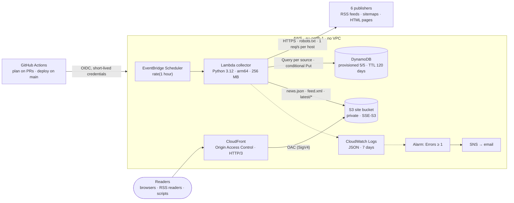
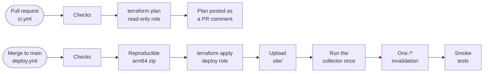

# AI News Radar: a serverless architecture on AWS

[](https://github.com/Minelli-D/ai-news-radar/actions/workflows/ci.yml)
[](https://github.com/Minelli-D/ai-news-radar/actions/workflows/deploy.yml)
[](LICENSE)

**This repository is about the infrastructure, not the app.** The application is deliberately
simple: once an hour it collects AI news headlines from six publishers and publishes them as a
web page, an RSS feed and a JSON file. That leaves the attention on the architecture: why each
AWS service is there, which alternatives I rejected, and what every choice costs in money, risk
and complexity.

It runs in production for **about one cent a month**:
[live site](https://d1tgqahtdqvv2q.cloudfront.net) ·
[feed.xml](https://d1tgqahtdqvv2q.cloudfront.net/feed.xml) ·
[news.json](https://d1tgqahtdqvv2q.cloudfront.net/news.json)

**Contents:**
[The workload](#the-workload-and-its-constraints) ·
[Architecture](#architecture) ·
[Decisions](#architecture-decisions) ·
[Failure modes](#failure-modes) ·
[Well-Architected review](#well-architected-review) ·
[Cost](#cost) ·
[At scale](#limits-and-what-i-would-change-at-scale) ·
[Concept index](#aws-concepts-in-this-repository) ·
[Deploy your own](#run-it-or-deploy-your-own-copy) ·
[The application](#the-application)

---

## The workload and its constraints

Almost every decision below follows from the shape of the workload:

| Property | Value | Consequence |
|---|---|---|
| **Writes** | One batch per hour that runs for about 9 seconds | Compute is needed for seconds per hour, so it must be pay-per-use |
| **Reads** | Any time, any volume, and every reader gets the same answer | The answer can be computed once and cached at the edge |
| **Data size** | A 43 KB snapshot; the table holds less than 1 MB | Storage and scaling are non-issues; access patterns are what matter |
| **Freshness** | News, not trading: up to 1 hour plus 5 minutes of cache is fine | Expire caches with a TTL instead of invalidating them |
| **Source of truth** | The publishers' own websites | The data can be rebuilt at any time, so it needs no backups |

Constraints I set before writing any code:

- **€0 a month by design.** Every service must fit an AWS *always-free* allowance. The following
  are ruled out up front: NAT Gateway, Lambda in a VPC, EC2, public IPv4 addresses, API Gateway,
  RDS, load balancers, customer-managed KMS keys, Secrets Manager, DynamoDB on-demand and PITR,
  and paid WAF.
- **No long-lived credentials**: no access keys anywhere, CI included.
- **Everything as code**: the whole stack is Terraform, and the pipeline deploys it on merge.
- **Responsible collection**: robots.txt for every host (RFC 9309), a User-Agent that
  identifies the project, one request per feed per run, and headlines only (title, link, date
  and a description of at most 200 characters, never the article body).

---

## Architecture



The system has two paths that never meet:

- **Write path, once an hour:** Scheduler → Lambda → publishers over HTTPS → DynamoDB (which
  items are new?) → S3 (publish the snapshot).
- **Read path, at any time:** reader → CloudFront edge → private S3 bucket through Origin
  Access Control, only on a cache miss. There is no compute and no database on the read path.

This is a CQRS-style split, and it is the core idea of the project. The write side is a small
batch job, and the read side is a CDN serving files.

**Delivery pipeline:**



The checks are the same for both workflows (`checks.yml`): ruff, mypy (strict), 194 pytest
tests and 21 `node --test` tests (all offline), `terraform fmt` and `validate`, TFLint, and
Trivy scans of the IaC and of the dependencies.

---

## Architecture decisions

Each decision records what was chosen, why, what was rejected, and the trade-off I accepted.
Expand a decision to read it.

<details>
<summary><b>ADR 1: Precompute the read model and serve static files</b></summary>

- **Decision:** the collector renders `news.json`, `feed.xml` and `latest/<source>` into S3
  once an hour. Readers only ever download files.
- **Why:**
  - Every reader gets the same answer, and it only changes when the collector runs, so
    computing it per request would repeat identical work for every visit.
  - With files, reads scale with the CDN rather than with my code: no cold starts, no
    throttling, no cost per request, and no application logic on the read path to attack.
- **Rejected:**
  - *API Gateway + Lambda:* compute on every request, and API Gateway has no always-free tier.
  - *A server rendering pages (EC2 or Fargate):* billed around the clock for a job that is idle
    more than 99% of the time, plus an OS or image to patch.
- **Trade-off:** readers can see data up to 1 hour + 5 minutes old, which is fine for news.

</details>

<details>
<summary><b>ADR 2: Lambda on arm64, started by EventBridge Scheduler, outside any VPC</b></summary>

- **Decision:** a Python 3.12 Lambda function (arm64, 256 MB, 60 s timeout), invoked by an
  EventBridge Scheduler schedule, `rate(1 hour)`, that has its own IAM role.
- **Why:**
  - Lambda bills per millisecond of a job that averages 9 seconds, and AWS runs it across
    several Availability Zones with no configuration.
  - Graviton (arm64) is billed 20% less per GB-second than x86 in eu-north-1.
  - Outside a VPC the function reaches the internet directly. Inside one, it would need a NAT
    Gateway, billed at $0.046 an hour in eu-north-1: about $34 a month before data charges,
    just to read RSS feeds.
  - EventBridge Scheduler is the purpose-built scheduler: a role per schedule, its own retry
    policy, time zones, and 14 million free invocations a month.
- **Rejected:**
  - *cron on EC2:* an always-on instance for 14 seconds of work an hour.
  - *Scheduled ECS task on Fargate:* billed per vCPU- and GB-hour, with a container image to
    maintain; too heavy for this job.
  - *GitHub Actions cron:* couples production to CI, and GitHub may delay or drop scheduled runs
    under load.
- **Trade-off:** Lambda caps a run at 15 minutes; this job uses 60 s at most. Scaling to
  hundreds of sources would need fan-out (see [At scale](#limits-and-what-i-would-change-at-scale)).

</details>

<details>
<summary><b>ADR 3: DynamoDB with keys designed for the only access pattern</b></summary>

- **Access patterns:** "the newest 20 items of source X" and "insert this item if it is new".
- **Decision:**
  - Partition key `source`; sort key `<publishedAt ISO-8601>#<sha256(canonical URL)>`.
  - Reads are `Query(ScanIndexForward=false, Limit=20)`.
  - Inserts are `PutItem` with an `attribute_not_exists` condition.
  - Expiry is a TTL attribute `expiresAt`, set to first seen + 120 days.
- **Why:**
  - The sort key orders items by time, so "newest 20" is one Query on one partition. It reads
    about 20 items whatever the table's size. A Scan would read everything and grow with the table.
  - The URL hash makes every key unique and makes de-duplication cheap. New items are compared
    by hash with the stored ones, so re-dated articles and tracking-parameter variants of a
    known URL are not counted as new.
  - The conditional put makes inserts idempotent (see ADR 6).
  - TTL deletions are free and consume no write capacity, so retention needs no cleanup job.
- **Capacity mode:** provisioned at 5 RCU / 5 WCU, with no auto scaling.
  - It sits inside the always-free 25 RCU / 25 WCU.
  - Fixed throughput is also a fixed cost ceiling: a runaway loop gets throttled, not billed.
  - On-demand is a legitimate choice too. At $0.67 per million writes and $0.1345 per million
    reads in eu-north-1, this workload would cost about a tenth of a cent a month.
    Provisioned wins because it is exactly €0 and bounded.
- **Rejected:**
  - *RDS or Aurora:* an always-on instance inside a VPC, with patching, for less than 1 MB of data.
  - *One JSON document in S3:* no atomic insert per item, and a full rewrite on every run.
  - *A global secondary index:* there is no second access pattern to serve.
- **Trade-offs:**
  - The first run (about 120 inserts) exceeds 5 WCU. Burst capacity (up to 300 seconds of
    unused throughput) and the SDK's `adaptive` retry mode absorb it. Whatever does not fit
    before the deadline is deferred to the next run.
  - Partitioning by source is right for six sources; at a much larger write volume a hot source
    would need write sharding.

</details>

<details>
<summary><b>ADR 4: A private S3 origin behind CloudFront with Origin Access Control</b></summary>

- **Decision:**
  - *Bucket:* every Block Public Access setting on, ACLs disabled (`BucketOwnerEnforced`),
    encrypted with SSE-S3.
  - *Origin access:* CloudFront signs its requests with SigV4 through Origin Access Control
    (OAC). The bucket policy allows `s3:GetObject` only when `AWS:SourceArn` is this distribution.
  - *Policies:* only AWS-managed ones, `CachingOptimized` and `CORS-and-SecurityHeadersPolicy`.
  - *Delivery:* HTTP/2 and HTTP/3, IPv6, compression, `redirect-to-https`, `PriceClass_100`.
- **Why:**
  - The bucket is never public: the CDN is the single entry point.
  - S3 Standard stores every object across at least three Availability Zones. CloudFront
    serves from edge caches, absorbs traffic spikes and includes AWS Shield Standard.
  - Managed policies leave nothing custom to maintain. They also keep the distribution eligible
    for CloudFront's flat-rate Free plan.
- **Caching instead of invalidation:**
  - Data files carry `Cache-Control: max-age=300`.
  - Static assets are cached for a day and busted with `?v=<git sha>`.
  - The collector never invalidates; the pipeline creates exactly one `/*` invalidation per
    deploy. Only the first 1,000 invalidation paths a month are free, and hourly invalidations
    would use them up.
- **Rejected:**
  - *S3 static website hosting:* it needs a public bucket, its endpoint is HTTP only, and it
    cannot use OAC.
  - *Origin Access Identity (OAI):* the legacy mechanism that OAC replaces.
  - *A custom domain:* a Route 53 hosted zone is paid (see [At scale](#limits-and-what-i-would-change-at-scale)).
- **Trade-off:** `PriceClass_100` serves only from edge locations in North America and Europe,
  so readers elsewhere see more latency. It caps the per-GB price if traffic ever outgrows the
  free tier.

</details>

<details>
<summary><b>ADR 5: Reliability inside a run (bulkheads, deadlines, write ordering)</b></summary>

- **Bulkheads.** Each source runs in its own thread with its own HTTP client. Any exception
  becomes that source's `error`, so one broken publisher cannot take down the other five.
- **Deadline budget.**
  - The run derives its deadline from Lambda's remaining time, minus 3 seconds.
  - It keeps 10 seconds free for writes and publishing after fetching, and 5 seconds for S3
    after the DynamoDB writes.
  - A source still running at the cutoff is reported as "timed out", and unwritten items are
    deferred to the next run.
  - The function never reaches its hard timeout in the middle of a write.
- **Write ordering.** `news.json` is written last. It is the baseline the next run compares
  against, so if the `feed.xml` upload fails, the next run retries it instead of forgetting
  it. S3's strong read-after-write consistency guarantees the next run reads that baseline.
- **Graceful degradation.** Each source's health (`ok`, `error`, `lastSuccessAt`) is published
  in `news.json` and shown on the page.
- **Alarm semantics.** The invocation fails, and the alarm fires, only on infrastructure errors
  (DynamoDB or S3) or when every source fails. A single publisher's outage is expected noise,
  so it is surfaced on the page instead of emailed.

</details>

<details>
<summary><b>ADR 6: Retries at the right layer, idempotency everywhere</b></summary>

| Layer | Setting | Why |
|---|---|---|
| EventBridge Scheduler → Lambda | Up to 2 retries within 1 hour | Covers failures to *deliver* the invocation |
| Lambda asynchronous invocation | 0 retries, maximum event age 1 hour | A retry would crawl every publisher again; the next scheduled run is the retry |
| DynamoDB SDK client | `adaptive` retry mode, 10 attempts | Client-side rate limiting absorbs throttling on a 5 WCU table |
| S3 SDK client | `standard` retry mode, 5 attempts | Transient 5xx errors |
| Data writes | Conditional `PutItem` | Asynchronous Lambda invocations can deliver the same event twice; a duplicate run inserts nothing twice |

</details>

<details>
<summary><b>ADR 7: Identity (OIDC federation, two CI roles, a permissions boundary)</b></summary>

- **No access keys.** GitHub Actions exchanges its OIDC token for short-lived STS credentials
  (1-hour maximum session).
- **Separation of duties.**
  - *`plan` role:* read-only, trusted only for this repository's `pull_request` workflows. It
    runs `terraform plan -lock=false`, so a pull request can never block a deploy.
  - *`deploy` role:* trusted only for `refs/heads/main`; its writes are limited to the exact
    resource names the stack uses.
- **Pinned subject.** The trust policies match GitHub's *immutable* OIDC subject, which
  contains the owner and repository IDs. A deleted and re-created repository with the same
  name therefore cannot assume the roles.
- **Escalation guard.**
  - The deploy role can create IAM roles only if they are named `ai-news-radar-app-*` and carry
    the `ai-news-radar-workload-boundary` permissions boundary (enforced with the
    `iam:PermissionsBoundary` condition key).
  - It can pass roles only to Lambda and EventBridge Scheduler (`iam:PassedToService`).
  - So CI cannot mint an admin role or widen its own permissions.
- **Least privilege for the workload.**
  - The collector may `PutObject` only on `news.json`, `feed.xml` and `latest/*`, and
    `GetObject` only on `news.json`.
  - It may `Query` and `PutItem` only on its own table, and write only to its own log group.
  - The scheduler's role trusts `scheduler.amazonaws.com` only for this account
    (`aws:SourceAccount`), which protects against the confused-deputy problem.
- **Trade-off:** `bootstrap/` (the OIDC provider, the CI roles and the boundary) is applied
  once, locally, by a person. It is the root of trust, so CI cannot change it.

</details>

<details>
<summary><b>ADR 8: Defence in depth for data and content</b></summary>

1. **Account-level S3 Block Public Access**, which the CI roles cannot change.
2. **Bucket-level Block Public Access**, with ACLs disabled.
3. **A bucket policy** that admits only this CloudFront distribution and denies any request
   made without TLS (`aws:SecureTransport = false`).
4. **Encryption at rest with AWS-managed keys**: SSE-S3, DynamoDB's default encryption and
   CloudWatch Logs' default encryption. A customer-managed KMS key ($1 a month each) would add
   key-policy control and an audit trail of key use, which headlines that are public anyway
   don't need.
5. **Untrusted input.**
   - Every link from a feed must be HTTPS on that source's allow-listed hosts, so a
     compromised feed cannot turn `/latest/<source>` into an open redirect.
   - Every redirect hop is re-validated.
   - Decompression has a size cap, and a 10-second total timeout holds even against servers
     that trickle bytes.
6. **Front end.**
   - A strict Content Security Policy (no inline script or style).
   - Data rendered only through `textContent`.
   - Managed security headers: HSTS, `nosniff`, frame options and referrer policy.
7. **Supply chain.**
   - Every GitHub Action is pinned to a commit SHA.
   - Trivy and TFLint are downloaded and verified against pinned SHA-256 values.
   - Every accepted scanner finding is a `#trivy:ignore` comment with its reason, next to the
     resource.

</details>

<details>
<summary><b>ADR 9: Infrastructure as code in two stacks, deployed by the pipeline</b></summary>

- **`bootstrap/`** (local state, applied once by the owner) holds:
  - the state bucket, the OIDC provider, the CI roles and the permissions boundary;
  - the budget and the account-level Block Public Access.

  It solves the chicken-and-egg problem (CI needs the state bucket and its roles before it can
  run) and keeps the root of trust out of CI's reach.
- **`infra/`** (S3 backend) holds everything the application runs on, and only the pipeline
  applies it. Locking is S3-native (`use_lockfile`), so there is no DynamoDB lock table.
- **State bucket:** versioned, old versions expire after 90 days, TLS only, `prevent_destroy`.
- **Deploys are serialized.** The `deploy-production` concurrency group queues deploys and never
  runs two applies at once. The Lambda package is reproducible: the same inputs give the same
  SHA-256.
- **Trade-off:** there is no staging environment. PR plans, offline tests, reproducible builds
  and post-deploy smoke tests are the safety net, and a revert commit is the rollback.

</details>

<details>
<summary><b>ADR 10: Cost as an architectural constraint</b></summary>

- **Designed around always-free allowances:**
  - Lambda, DynamoDB provisioned capacity (25/25) and EventBridge Scheduler (14M invocations);
  - CloudFront (1 TB and 10M requests), CloudWatch (10 alarms, 5 GB of logs) and SNS (1,000 emails).
- **S3 is the only metered service.** Change-aware publishing uploads `feed.xml` and
  `latest/*` only when their content changes, so a run with no news writes a single object.
  In production, 13 of the first 15 runs wrote only `news.json`.
- **Paid extras left out on purpose:** 7-day log retention, and no X-Ray, access logs or custom
  metrics.
- **Ceilings built into the architecture:**
  - provisioned DynamoDB capacity;
  - no compute per request;
  - `PriceClass_100`.
- **A $5 monthly AWS Budget** emails at 50% and 100% of actual spend. It excludes credits;
  otherwise a new account's credits would hide real usage behind a $0 bill.

</details>

<details>
<summary><b>ADR 11: Observability sized to the system</b></summary>

- **One structured JSON summary line per run**, written with Lambda's native JSON log format and
  queryable in Logs Insights. It records what was fetched, new and failed per source, what was
  published and deferred, and how long the run took.
- **A metric alarm on `AWS/Lambda` `Errors ≥ 1` over one hour**, which emails through SNS and
  also sends the recovery (OK) notification. Missing data is treated as not breaching.
- **Source health is part of the product** (in `news.json` and on the page), so partial
  failures are visible without an alarm.
- **Rejected:** X-Ray tracing and CloudFront standard logs, which add cost and storage without
  new insight for one hourly job.

</details>

---

## Failure modes

| Failure | What happens | Recovery |
|---|---|---|
| An Availability Zone fails | Nothing visible. S3 Standard, DynamoDB, Lambda (outside a VPC), EventBridge Scheduler and SNS are regional services that run across several AZs; CloudFront is global | Automatic |
| eu-north-1 is unavailable | Collection stops; CloudFront keeps serving its cached copies until they expire | Accepted risk: [multi-Region](#limits-and-what-i-would-change-at-scale) is not worth it for hourly news |
| One publisher is down, slow or changes its HTML | That source is flagged as unhealthy in `news.json` and on the page; the other five update normally | Automatic on its next good run |
| Every publisher fails (for example, no network) | The invocation fails → alarm → email | The next hourly run |
| DynamoDB throttles | Adaptive retries; items not written before the deadline are deferred | The next run |
| An S3 upload fails mid-publish | `news.json` (the baseline) is written last, so the next run sees the change again and re-uploads | The next run |
| The same invocation is delivered twice | Conditional puts write nothing twice; `news.json` is just rewritten | None needed |
| Traffic spike or network-layer DDoS | Served from edge caches, with Shield Standard included; origin requests are bounded by the 5-minute TTL | Automatic |
| A compromised or hostile feed | Links that are off the allow-list or not HTTPS are dropped; text is handled as plain text; feed output is HTML-escaped; size caps and timeouts apply | Automatic |
| A bad deploy | Blocked earlier by checks and the PR plan; otherwise the smoke tests fail the pipeline | Revert the commit; the pipeline redeploys |
| Terraform state is damaged or deleted | The state bucket is versioned (90 days of history) and has `prevent_destroy` | Restore a previous version |

---

## Well-Architected review

| Pillar | How the design addresses it | Known gap |
|---|---|---|
| **Operational excellence** | Everything is IaC; plans on pull requests; automated deploys with smoke tests; structured logs; one meaningful alarm | No staging environment |
| **Security** | OIDC instead of keys; least privilege plus a permissions boundary; a private origin behind OAC; encryption at rest and in transit; pinned supply chain | No WAF (paid); no customer-managed keys |
| **Reliability** | Multi-AZ managed services; bulkheads; deadlines; idempotent writes; ordered publishing; data rebuildable from the sources | Single Region |
| **Performance efficiency** | Precomputed responses served from the edge; HTTP/3 and compression; one Query per source | `PriceClass_100` covers North America and Europe only |
| **Cost optimization** | Always-free by design; arm64; no VPC or NAT; change-aware writes; TTL; budget alerts | S3 requests are the only metered item (about a cent a month) |
| **Sustainability** | Compute runs for seconds per hour, on Graviton; nothing idles; the CDN avoids repeated work | None significant |

---

## Cost

Estimated from measurements on the live stack in eu-north-1 and AWS's published prices. Over
the first 15 runs, a run took 8.8 seconds on average (6.8–13.8 s) at 256 MB, with no errors or
throttles. The site bucket holds 15 objects (123 KB), and a month has about 744 runs.

| Service | Monthly usage | List price | Always-free allowance | Billed |
|---|---|---|---|---|
| DynamoDB, provisioned 5/5 | 3,720 RCU-hours + 3,720 WCU-hours, < 1 MB | $3.12 | 25 RCU + 25 WCU + 25 GB | $0 |
| CloudWatch alarm | 1 alarm | $0.10 | 10 alarms | $0 |
| Lambda, arm64 | ~750 requests, ~1,650 GB-seconds | $0.02 | 1M requests + 400,000 GB-seconds | $0 |
| CloudFront | a few thousand requests, < 1 GB | < $0.01 | 1 TB + 10M requests | $0 |
| CloudWatch Logs | a few MB, kept 7 days | < $0.01 | 5 GB | $0 |
| EventBridge Scheduler | 744 invocations | < $0.01 | 14M invocations | $0 |
| SNS, Budgets, IAM, OIDC provider | a handful of emails | $0 | free | $0 |
| **S3** (site and state buckets) | ~1,650 PUT/LIST, ~4,000 GET, 0.25 MB | ≈ $0.01 | **none** | **≈ $0.01** |
| **Total** | | **≈ $3.26** | | **≈ $0.01** |

About 96% of the list price is DynamoDB provisioned capacity. That is why the table stays at
5/5: the account-wide total must stay within 25/25 for the bill to stay at zero.

---

## Limits and what I would change at scale

| If… | I would… | Why it isn't built today |
|---|---|---|
| The site needed to survive a Region outage | Replicate the bucket with S3 Cross-Region Replication, put a CloudFront origin group in front for failover, and use DynamoDB global tables with a schedule in each Region (writes are already idempotent) | The data is rebuildable from the sources, and a second Region breaks the €0 goal |
| There were hundreds of sources | Fan out with one Lambda invocation per source (a Step Functions Map state or SQS) instead of threads in one 60-second function | Six sources finish in seconds |
| It needed its own domain | Route 53 plus an ACM certificate (issued in us-east-1 for CloudFront), and the CSP as a response header instead of a `<meta>` tag | A hosted zone costs $0.50 a month |
| Abuse became a risk | CloudFront's flat-rate Free plan, which caps the bill even under attack, or AWS WAF rate-based rules | The flat-rate plan needs a WAF web ACL and Terraform cannot manage it yet; WAF on its own is paid |
| Write volume grew | On-demand capacity or auto scaling, and time-bucketed partition keys so one busy source doesn't become a hot partition | 5 WCU is plenty today |
| Operations needed deeper insight | Per-source custom metrics (Embedded Metric Format) and X-Ray traces | The JSON summary line answers every question so far |

---

## AWS concepts in this repository

<details>
<summary><b>A map from each AWS concept to the file that implements it</b></summary>

| Concept | Where |
|---|---|
| Origin Access Control, bucket policy scoped with `AWS:SourceArn` | [`infra/cdn.tf`](infra/cdn.tf), [`infra/site.tf`](infra/site.tf) |
| Managed cache and response-headers policies, custom 404 page | [`infra/cdn.tf`](infra/cdn.tf) |
| S3 Block Public Access (account and bucket), `BucketOwnerEnforced`, deny non-TLS | [`bootstrap/guardrails.tf`](bootstrap/guardrails.tf), [`infra/site.tf`](infra/site.tf) |
| Lambda on arm64, JSON logging, asynchronous invoke configuration | [`infra/collector.tf`](infra/collector.tf) |
| EventBridge Scheduler role with `aws:SourceAccount`, retry policy | [`infra/collector.tf`](infra/collector.tf) |
| Least-privilege policy down to object keys | [`infra/collector.tf`](infra/collector.tf) |
| DynamoDB composite key, TTL, provisioned capacity, PITR off | [`infra/storage.tf`](infra/storage.tf) |
| `Query` with `ScanIndexForward`, conditional `PutItem` | [`collector/storage.py`](collector/storage.py) |
| SDK retry modes (`adaptive` vs `standard`), deadline from the Lambda context | [`collector/handler.py`](collector/handler.py) |
| Bulkheads and deadline budgets | [`collector/pipeline.py`](collector/pipeline.py) |
| OIDC web identity federation with a pinned `sub` | [`bootstrap/github_oidc.tf`](bootstrap/github_oidc.tf) |
| Permissions boundary, `iam:PermissionsBoundary`, `iam:PassedToService` | [`bootstrap/github_permissions.tf`](bootstrap/github_permissions.tf) |
| Remote state with S3-native locking | [`infra/versions.tf`](infra/versions.tf), [`bootstrap/state.tf`](bootstrap/state.tf) |
| Versioning and noncurrent-version lifecycle expiration | [`bootstrap/state.tf`](bootstrap/state.tf) |
| CloudWatch metric alarm → SNS email | [`infra/monitoring.tf`](infra/monitoring.tf) |
| AWS Budgets that exclude credits | [`bootstrap/guardrails.tf`](bootstrap/guardrails.tf) |
| Cache-Control instead of invalidations, cache busting with the git SHA | [`collector/publish.py`](collector/publish.py), [`scripts/deploy_site.sh`](scripts/deploy_site.sh) |
| CI/CD with OIDC, plan comments on pull requests, serialized deploys | [`.github/workflows/`](.github/workflows/) |

</details>

---

## Run it or deploy your own copy

**Locally, with live data and no AWS account:**

```bash
uv venv --python 3.12 .venv && uv pip install --python .venv/bin/python -r requirements-dev.txt
.venv/bin/python scripts/run_local.py --out build/preview --serve 8000   # → http://127.0.0.1:8000
.venv/bin/pytest                                   # offline: fixtures only, sockets are blocked
.venv/bin/ruff check . && .venv/bin/ruff format --check . && .venv/bin/mypy
node --test tests/site/*.test.mjs
```

**On your own AWS account.** You need Terraform ≥ 1.11, Python 3.12, the AWS CLI, and an
account where you may create IAM OIDC providers. Accounts made with AWS's new "Sign up for AWS"
flow block `iam:*Provider*` until you upgrade to the Paid plan and activate advanced features.

1. **Fork and clone** the repository.
   - Set `github_repository` in `bootstrap/` and `infra/`.
   - Set `github_oidc_subject_prefix` in `bootstrap/` to the output of
     `gh api repos/<owner>/<name>/actions/oidc/customization/sub`. If it is wrong, the deploy
     fails with "Not authorized to perform sts:AssumeRoleWithWebIdentity".
2. **Bootstrap once**, locally, with your own credentials (see [`bootstrap/README.md`](bootstrap/README.md)):
   ```bash
   cd bootstrap && cp terraform.tfvars.example terraform.tfvars   # set alert_email
   terraform init && terraform apply
   terraform output github_actions_variables
   ```
3. **Configure the GitHub repository** under *Settings → Secrets and variables → Actions*:
   - the variables `AWS_REGION`, `AWS_PLAN_ROLE_ARN`, `AWS_DEPLOY_ROLE_ARN` and `TF_STATE_BUCKET`;
   - the secret `ALERT_EMAIL`.
4. **Push to `main`.** The deploy workflow builds, applies, uploads the site, runs the
   collector, invalidates once and runs the smoke tests.
5. **Confirm the SNS subscription email**, so that alarms reach you.

---

## The application

<details>
<summary><b>What it collects and publishes</b></summary>

<br>

<picture>
  <source media="(prefers-color-scheme: dark)" srcset="docs/screenshot-dark.png">
  
</picture>

| Source | Where the news comes from |
|---|---|
| Anthropic | https://www.anthropic.com/news: no RSS, so the adapter reads the CMS data embedded in the page |
| OpenAI | https://openai.com/news/rss.xml |
| DeepSeek | https://api-docs.deepseek.com: no feed, so it reads the sitemap, then the newest announcement page |
| Google | [Google AI blog](https://blog.google/innovation-and-ai/technology/ai/rss/) + [Google DeepMind blog](https://deepmind.google/blog/rss.xml) |
| AWS | [What's New](https://aws.amazon.com/about-aws/whats-new/recent/feed/), filtered to AI/ML by AWS's own tags and title keywords |
| Hugging Face | [Daily Papers API](https://huggingface.co/api/daily_papers): the 5 most-upvoted papers of each day, added the next day once the votes have settled, under their own filter but left out of "All" and the RSS feed |

| Path | What it is |
|---|---|
| `/` | The page: a 30-day radar per company, the latest 60 items grouped by day, and source health |
| `/news.json` | Every source's latest items plus its health (CORS enabled) |
| `/feed.xml` | A combined RSS 2.0 feed of the newest 60 news items (Hugging Face papers are left out) |
| `/latest/<source>` | A redirect to that source's newest post |

Only the title, link, date and a description of at most 200 characters are stored and shown.
Article bodies are never stored or republished.

**Adding a source** takes a module in `collector/sources/` with an `allowed_hosts` list, a
trimmed real fixture, an adapter test, a registry entry and a badge colour. The filters, the
radar, `news.json` and `/latest/<slug>` pick it up automatically.

</details>

**How it was built:** with [Claude Code](https://claude.com/claude-code), under a
human-in-the-loop workflow. I set the constraints and made the architecture calls, and every
`terraform apply` and every push waited for my approval. The build journal is in
[`docs/journey.html`](docs/journey.html).

Not affiliated with Anthropic, OpenAI, Google, DeepSeek, Amazon or Hugging Face.
Released under the [MIT License](LICENSE).
